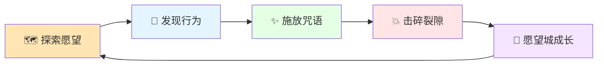

# 🌟 点点 · 微习惯养成游戏

> **产品定位**: 一款基于福格行为模型的「人生愿望修炼游戏」
> **核心理念**: 让用户在"玩"的过程中,自然形成微习惯、澄清愿望、理解自我

---

## 📖 设计文档导航

| 文档 | 描述 | 阅读顺序 |
|------|------|----------|
| [🌍 世界观与故事](./01_世界观与故事.md) | 游戏世界观、角色设定、叙事设计 | 1 |
| [🎮 核心玩法循环](./02_核心玩法循环.md) | 游戏机制、系统循环、玩法规则 | 2 |
| [🧩 系统设计](./03_系统设计.md) | 愿望系统、行为工坊、卡组系统详设 | 3 |
| [📅 七天主线剧本](./04_七天主线剧本.md) | Day1~Day7完整剧情脚本与台词 | 4 |
| [🎨 UI与交互规范](./05_UI与交互规范.md) | 视觉风格、组件规范、动效标准 | 5 |
| [📦 内容素材库](./06_内容素材库.md) | 愿望库、行为库、台词库、裂变规则 | 6 |

---

## 💡 游戏核心价值

```
┌─────────────────────────────────────────────────────────────────┐
│                                                                 │
│   🎯 不是"习惯打卡工具",而是"人生技能养成游戏"                │
│                                                                 │
│   ┌─────────────┐   ┌─────────────┐   ┌─────────────┐          │
│   │   愿意玩    │ + │  被引导思考  │ + │ 自然形成行为 │          │
│   │ 情绪价值    │   │  愿望澄清    │   │  低摩擦     │          │
│   │ 即时反馈    │   │  行为探索    │   │  正反馈     │          │
│   │ 惊喜感     │   │  认知升级    │   │  成长感     │          │
│   └─────────────┘   └─────────────┘   └─────────────┘          │
│                                                                 │
└─────────────────────────────────────────────────────────────────┘
```

---

## 🎮 30秒理解核心玩法

```
用户 = 「微光法师」
愿望 = 「需要修复的愿望城」
习惯 = 「微行动咒语」
完成 = 「击碎裂隙之影」

每天施放一个微行动咒语 → 击碎裂隙 → 愿望城逐渐修复 → 7天完成一座城
```

---

## 🔄 核心体验循环



---

## 📊 设计原则

### 🎯 游戏化原则

| 原则 | 传统习惯App | 点点 |
|------|------------|------|
| **目标设定** | 用户自定义 | 游戏引导探索 |
| **行为门槛** | 用户自行判断 | 系统智能裂变到极小 |
| **反馈机制** | ✓ 打勾 | 💥 击碎裂隙动画 + 🎭 角色对话 + 🏆 成就解锁 |
| **失败惩罚** | 断签/掉等级 | 温和提示"救援咒语已准备好" |
| **长期驱动** | 连续打卡天数 | 愿望城修复 + 角色成长 + 认知升级 |

### 🧠 福格模型应用

```
行为(B) = 动机(M) × 能力(A) × 提示(P)
         ↓           ↓           ↓
      愿望排序      行为裂变    AI锚点绑定
      核心愿望      保底卡30秒   "刷牙后→"
```

### 💚 心理安全原则

- ❌ **不惩罚**: 断签不扣分、不掉等级、不红色警告
- ❌ **不羞辱**: Rift的阻力宣言是"可被击碎"的轻量阻力
- ❌ **不攀比**: 不做排行榜、不做社交压力
- ✅ **温和引导**: "救援咒语已准备好,微光不会消失"

---

## 🎭 角色设定速览

| 角色 | 定位 | 风格 | 职责 |
|------|------|------|------|
| 🌟 **Arc** 弧光导师 | 主引导 | 克制温暖 | 主线剧情、每日鼓励、重要节点 |
| ✨ **MIA** 魔法师米娅 | 工坊助手 | 活泼发散 | 行为探索、召唤裂变、AI对话 |
| 🌑 **Rift** 裂隙之影 | 阻力象征 | 诱惑低语 | 每日阻力宣言(被击碎的对象) |

---

## 📅 MVP功能范围

### ✅ Must Have (P0)

- 世界观开场 + 角色创建(4选1天赋)
- 愿望排序游戏(两两对决 + 命运盘)
- 行为工坊(召唤 + AI锚点 + 裂变 + 合成)
- 每日一张微行动卡(击碎裂隙反馈)
- 7天主线剧情(愿望城修复)
- AI集成(锚点生成 + MAP评估)

### ❌ Won't Have (本期不做)

- 社交功能(好友/排行榜/分享)
- 提醒推送
- 商业化(会员/广告)
- 数据分析图表
- 多端适配

---

## 📁 文档结构

```
docs/design/
├── README.md                    # 本文档 - 设计概述
├── 01_世界观与故事.md            # 世界观、角色、叙事
├── 02_核心玩法循环.md            # 游戏机制、系统循环
├── 03_系统设计.md               # 各系统详细设计
├── 04_七天主线剧本.md            # 完整剧情脚本
├── 05_UI与交互规范.md            # 视觉规范、动效标准
└── 06_内容素材库.md              # 愿望/行为/台词库
```

---

## 🎯 设计目标

| 指标 | 目标值 | 说明 |
|------|--------|------|
| Day 1 完成率 | ≥80% | 用户能顺利完成首日流程 |
| Day 7 完成率 | ≥30% | 用户愿意持续7天 |
| 日均完成率 | ≥50% | 每日活跃用户完成微行动 |
| NPS | ≥40 | 用户愿意推荐 |

---

> 📝 **设计理念**: 我们相信,真正的习惯养成不是靠意志力对抗,而是让行为小到无法拒绝,让反馈有趣到想要继续。点点不是让你"更自律",而是让你"更懂自己"。
