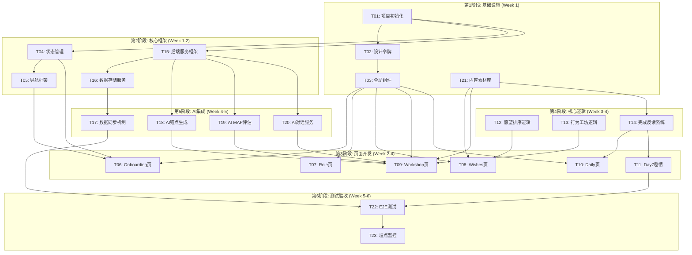

# 📋 点点 · 开发任务管理

> 版本: 1.0-MVP
> 最后更新: 2026-02-01
> 预估总工期: 6周（按2人团队计算）

---

## 一、任务总览

本目录包含点点微习惯游戏MVP阶段的所有开发任务。任务按照**模块化、独立性、可并行**的原则划分，支持前后端分离开发和独立测试验证。

### 任务分类

| 分类 | 任务数 | 说明 |
|------|--------|------|
| 🔧 **基础架构** | 3 | 项目初始化、状态管理、导航框架 |
| 🎨 **UI组件库** | 2 | 设计令牌、全局组件 |
| 📱 **前端页面** | 6 | Onboarding、Role、Wishes、Workshop、Daily、Day7 |
| ⚡ **核心功能** | 4 | 愿望排序、行为工坊、卡片抽取、完成反馈 |
| 🤖 **AI服务** | 3 | 锚点生成、MAP评估、AI对话 |
| 🌐 **后端服务** | 3 | 服务框架、数据存储、同步机制 |
| 📦 **内容素材** | 2 | 愿望库/行为库、台词库 |
| ✅ **测试验收** | 2 | E2E测试、埋点监控 |

---

## 二、任务依赖图



---

## 三、里程碑计划

| 里程碑 | 日期 | 交付内容 | 验收标准 |
|--------|------|----------|----------|
| **M1: 基础框架** | Week 1结束 | 项目结构、状态管理、导航、UI组件库、内容素材库 | 能够启动小程序，页面能正常切换 |
| **M2: 首次体验流程** | Week 3结束 | Onboarding→Role→Wishes→Workshop→Daily完整流程 | 用户能走完首次使用流程 |
| **M3: AI功能集成** | Week 4结束 | AI锚点生成、MAP评估、对话服务可用 | AI功能正常调用且有降级方案 |
| **M4: MVP完整版** | Week 5结束 | Day7剧情、数据同步、完整闭环 | 用户能完成7天主线 |
| **M5: 测试验收** | Week 6结束 | E2E测试通过、埋点部署、性能优化 | 崩溃率<1%，主流程成功率>99% |

---

## 四、任务列表

### 4.1 基础架构任务

| ID | 任务名称 | 优先级 | 预估工时 | 依赖 |
|----|---------|--------|----------|------|
| T01 | [项目初始化与基础配置](./T01_项目初始化.md) | P0 | 0.5天 | 无 |
| T04 | [全局状态管理系统](./T04_状态管理.md) | P0 | 1天 | T01 |
| T05 | [页面导航框架](./T05_导航框架.md) | P0 | 0.5天 | T04 |

### 4.2 UI组件任务

| ID | 任务名称 | 优先级 | 预估工时 | 依赖 |
|----|---------|--------|----------|------|
| T02 | [设计令牌与样式变量](./T02_设计令牌.md) | P0 | 0.5天 | T01 |
| T03 | [全局UI组件库](./T03_全局组件.md) | P0 | 1.5天 | T02 |

### 4.3 前端页面任务

| ID | 任务名称 | 优先级 | 预估工时 | 依赖 |
|----|---------|--------|----------|------|
| T06 | [Onboarding世界观开场页](./T06_Onboarding页.md) | P0 | 0.5天 | T03, T05 |
| T07 | [Role角色创建页](./T07_Role页.md) | P0 | 0.5天 | T03 |
| T08 | [Wishes愿望排序页](./T08_Wishes页.md) | P0 | 1.5天 | T03, T12, T21 |
| T09 | [Workshop行为工坊页](./T09_Workshop页.md) | P0 | 2天 | T03, T13, T21, T18, T19, T20 |
| T10 | [Daily每日卡片页](./T10_Daily页.md) | P0 | 1.5天 | T03, T14 |
| T11 | [Day7剧情与愿望城完成](./T11_Day7剧情.md) | P0 | 1天 | T10, T14 |

### 4.4 核心功能任务

| ID | 任务名称 | 优先级 | 预估工时 | 依赖 |
|----|---------|--------|----------|------|
| T12 | [愿望排序核心逻辑](./T12_愿望排序逻辑.md) | P0 | 1天 | T04 |
| T13 | [行为工坊核心逻辑](./T13_行为工坊逻辑.md) | P0 | 1.5天 | T04, T21 |
| T14 | [完成反馈与裂隙击碎系统](./T14_完成反馈系统.md) | P0 | 1.5天 | T04, T21 |

### 4.5 后端服务任务

| ID | 任务名称 | 优先级 | 预估工时 | 依赖 |
|----|---------|--------|----------|------|
| T15 | [后端服务框架搭建](./T15_后端服务框架.md) | P0 | 2天 | T01 |
| T16 | [数据存储服务](./T16_数据存储服务.md) | P0 | 1.5天 | T15 |
| T17 | [前后端数据同步机制](./T17_数据同步机制.md) | P0 | 1.5天 | T04, T16 |

### 4.6 AI服务任务

| ID | 任务名称 | 优先级 | 预估工时 | 依赖 |
|----|---------|--------|----------|------|
| T18 | [AI锚点生成服务](./T18_AI锚点生成.md) | P0 | 2天 | T15 |
| T19 | [AI MAP评估服务](./T19_AI_MAP评估.md) | P0 | 2天 | T15 |
| T20 | [AI对话服务](./T20_AI对话服务.md) | P1 | 1天 | T15 |

### 4.7 内容素材任务

| ID | 任务名称 | 优先级 | 预估工时 | 依赖 |
|----|---------|--------|----------|------|
| T21 | [愿望库与行为库](./T21_内容素材库.md) | P0 | 2天 | 无 |

### 4.8 测试验收任务

| ID | 任务名称 | 优先级 | 预估工时 | 依赖 |
|----|---------|--------|----------|------|
| T22 | [E2E测试与功能验证](./T22_E2E测试.md) | P0 | 2天 | 全部功能任务 |
| T23 | [埋点与数据监控](./T23_埋点监控.md) | P1 | 1天 | T22 |

---

## 五、并行开发建议

### 5.1 前端开发者任务流

```
Week 1: T01 → T02 → T03
Week 2: T04 → T05 → T06 → T07
Week 3: T08 → T10
Week 4: T09 → T11
Week 5: T17 → T22
Week 6: T23 → Bug修复
```

### 5.2 后端开发者任务流

```
Week 1: T01(配合) → T21
Week 2: T15 → T16
Week 3: T18 → T19
Week 4: T20 → T12 → T13 → T14
Week 5: T17(配合) → T22(配合)
Week 6: Bug修复 → 性能优化
```

### 5.3 独立验证点

每个任务完成后可独立验证：

| 任务 | 验证方式 |
|------|----------|
| T03 | 组件预览页，验证所有组件样式和交互 |
| T04 | 单元测试，验证状态读写和持久化 |
| T12 | 单元测试，验证排序算法和概率分布 |
| T13 | 单元测试，验证召唤/裂变/合成逻辑 |
| T14 | 单元测试，验证抽卡概率和完成流程 |
| T15 | API测试，验证健康检查、认证、基础路由 |
| T18/T19/T20 | API测试，验证AI接口响应和降级 |
| T22 | E2E测试，验证完整流程 |

---

## 六、任务状态

| 状态 | 描述 |
|------|------|
| ⏳ TODO | 待开发 |
| 🚧 WIP | 开发中 |
| 👀 REVIEW | 待审核 |
| ✅ DONE | 已完成 |
| ❌ BLOCKED | 阻塞中 |

---

> 📝 **使用说明**: 每个任务详情请查看对应的任务文档（TXX_任务名.md）。任务文档包含详细的需求描述、验收标准、技术实现指引等内容。
